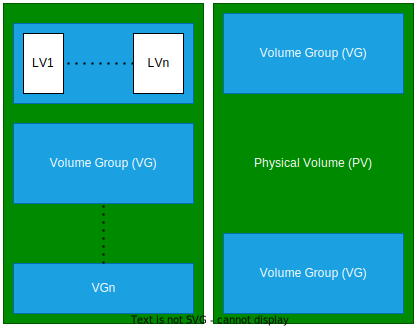

LVM (aka Logical Volume Manager) is a tool for logical volume management which includes allocating disks, striping, mirroring and resizing logical volumes.

## Overview



LVM consists of **three** main components:

- Physical Volume (**PV**)
- Volume Group (**VG**)
- Logical Volume (**LV**)

## Physical Volume

A physical volume is a collection of disk partitions used to store all server data.
These are the physical hard drives that are mounted to the CPU.

Physical volumes are usually mounted on `/dev/sda`,`/dev/sdb`, and so on.

### Creating a Physical Volume

To create a physical volume use `pvcreate` command

```console
pvcreate <device_name>
```

!!! example

    ```console
    pvcreate /dev/sda
    ```

The above command initializes/creates a physical volume.

!!! note

        Change `/dev/sda` according to your physical device name.
        To list all the volumes available use `lsblk` or `fdisk -l`.

### Display Physical Volumes

To display a physical volume use `pvdisplay` or `pvs` or `pvscan` commands.

## Volume Groups

A volume group (**VG**) is what we create when we combine multiple physical volumes to create a single storage structure, equal to the storage capacity of the combined physical devices.

### Creating a Volume Group

To create a volume group use `vgcreate` command

```console
vgcreate <vgname> <device_name>
```

!!! example

    ```console
    vgcreate vg00 /dev/sda
    ```

### Display Volume Groups

To display a volume groups use `vgdisplay` or `vgs` or `vgscan` commands.

### Extending Volume Group

To extend a volume group use `vgextend` command

```console
vgextend <vgname> <device_name>
```

## Logical Volume

After you create a volume group, you can create logical volumes within that volume group. A logical volume, although it may reside on noncontiguous physical partitions or even on more than one physical volume, appears to users and applications as a single, contiguous, extensible disk volume

### Creating a Logical Volume

To create a logical volume use `lvcreate` command

```console
lvcreate -n <lvname> -L <lvsize_in_M/G> <vgname>
```

!!! example

    ```console
    lvcreate -L 50G -n gfslv vg0
    ```

### Display Logical Volume

To display a logical volume use `lvdisplay` or `lvs` or `lvscan` commands.

### Extending Logical Volume

To extend a volume group use `lvextend` command

```console
lvextend -L [+/-]<size_to_be_inc/dec_number> <path_to_lv> -r
```

`-r` is used to automatically format the allocated storage to required type like ext4,xfs, etc.

!!! example

    ```console
    lvextend -L +50G /dev/mapper/testvg-testlv -r
    ```
